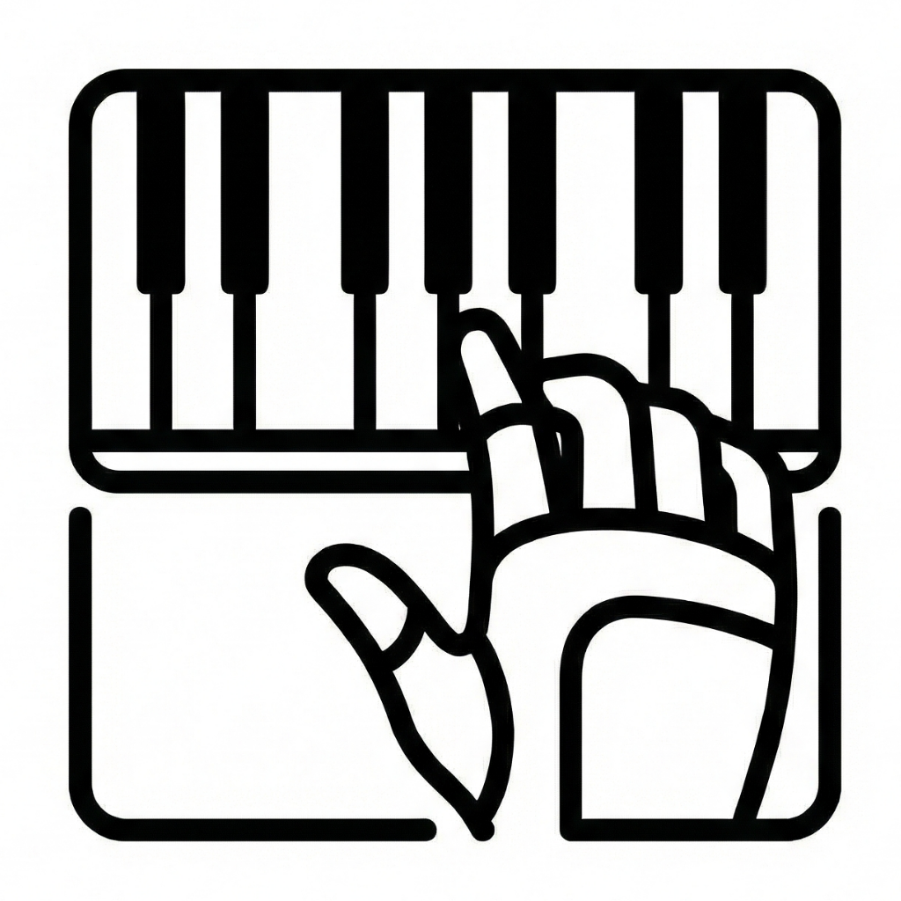
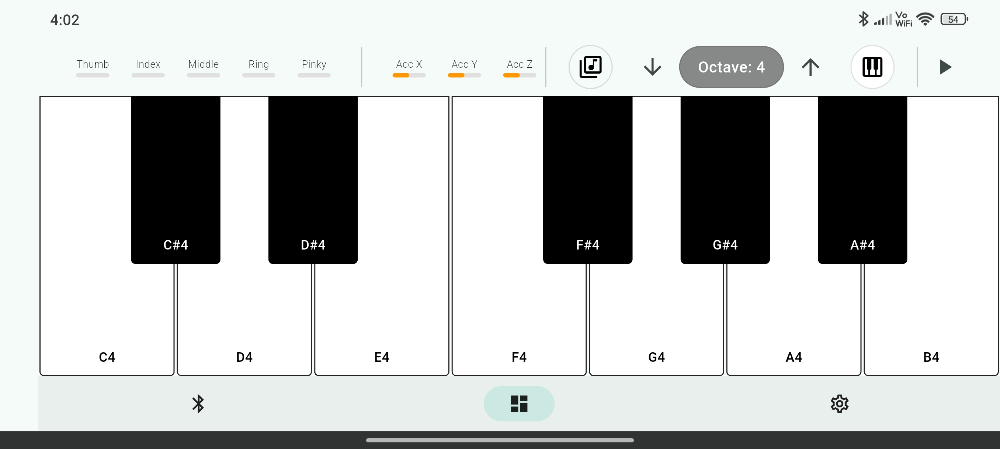
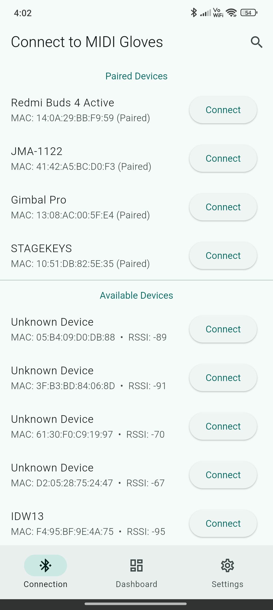
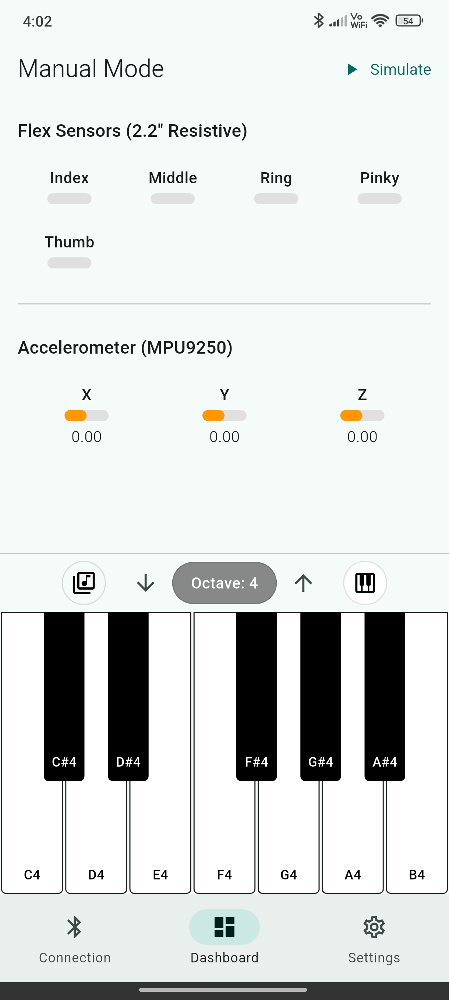
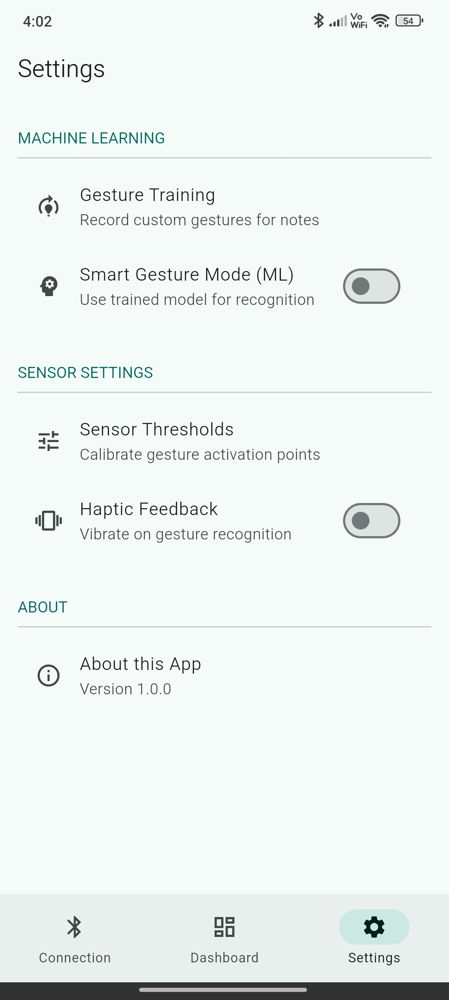

  
  <h1>MIDI Gloves</h1>
  
<strong>MACHINE LEARNING-TRAINED GESTURE-CONTROLLED MIDI GLOVES</strong>

  
A Thesis Project by Tres Juans

  

    <a href="#features">Features</a> •
    <a href="#tech-stack">Tech Stack</a> •
    <a href="#getting-started">Getting Started</a> •
    <a href="#download">Download</a>
  

---

## 🎹 About the Project

**MIDI Gloves** is an innovative mobile application that transforms hand gestures into MIDI signals. Designed as a thesis project, it allows musicians and performers to control digital audio workstations (DAWs) wirelessly using custom-built sensor gloves.

The app serves as the central hub, bridging the physical gloves with your music production software via Bluetooth Low Energy (BLE).

## ✨ Key Features

### 🎛️ Interactive Dashboard

Monitor your performance in real-time. The dashboard visualizes sensor data and active MIDI notes, ensuring you stay in control of your sound.

  

### 🔗 Seamless Connectivity

Connect your MIDI Gloves effortlessly using Bluetooth Low Energy. The app scans, pairs, and maintains a stable low-latency connection for live performance reliability.

  
  

### ⚙️ Deep Customization

Tailor the experience to your playing style. Adjust sensor sensitivity, map specific gestures to MIDI channels, and configure control change (CC) messages directly from the settings.

   

## 🛠️ Tech Stack

Built with performance and reliability in mind:

- **Framework**: [Flutter](https://flutter.dev/) (Dart)
- **Connectivity**: Bluetooth Low Energy (Flutter Blue Plus)
- **Audio/MIDI**: `flutter_midi_pro`, `dart_melty_soundfont`
- **State Management**: Provider

## 🚀 Getting Started

### Prerequisites

- Android Device (Android 5.0+)
- MIDI Gloves Hardware (Prototype)
- DAW (Ableton Live, FL Studio, Logic Pro, etc.)

### Installation

1.  **Download** the latest APK from the [Releases Page](../../releases).
2.  **Install** the APK on your Android device (ensure "Install from Unknown Sources" is enabled).
3.  **Launch** the app and grant Bluetooth permissions.

## 📦 Download

Ready to try it out? Download the latest stable release:

## 👥 Credits

**Tres Juans**

- _Developer & Hardware Logic_
- _Thesis Authors_

---

  Built with ❤️ using Flutter.

